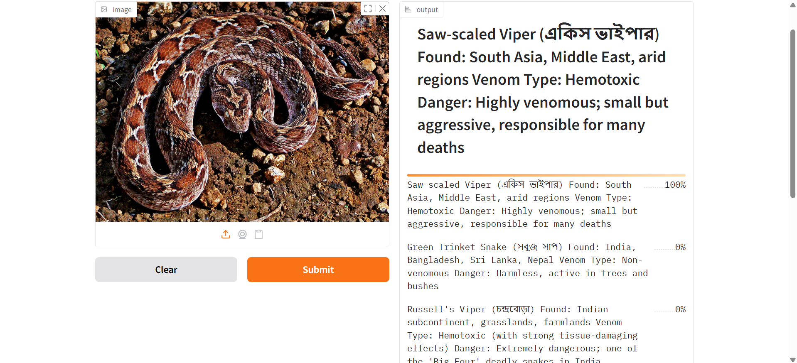
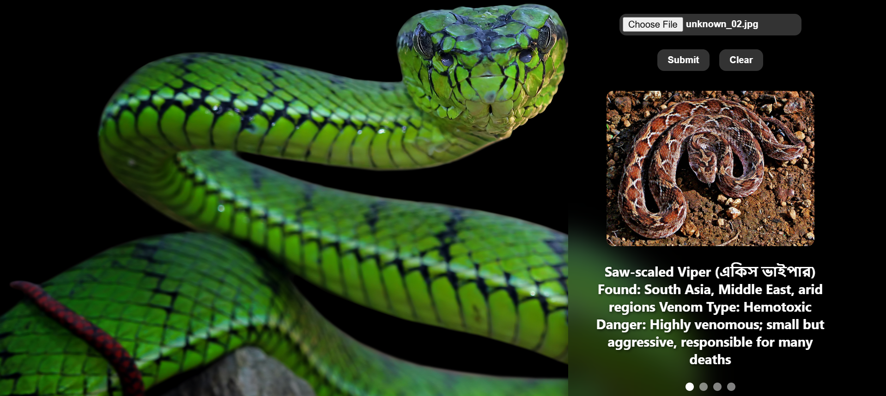

<!-- 

# 🐍 Bangladeshi Snake Recognizer

  
  
  
  
  
  

A machine learning project to recognize **17 common snake species in Bangladesh** from images. The project includes data collection, cleaning, model training, deployment, and API integration.

---

## 📑 Table of Contents

1. [📂 Data Collection](#-1-data-collection)  
2. [📊 Data Preparation](#-2-data-preparation)  
3. [🧹 Dataset Cleaning](#-3-dataset-cleaning)  
4. [🏋️ Training the Snake Classifier](#%EF%B8%8F-4-training-the-snake-classifier)
   - [ResNet34](#41-resnet34)  
   - [EfficientNet-B0](#42-efficientnet-b0)  
   - [ResNet50](#43-resnet50)  
   - [Summary](#-summary-of-model-performance)  
5. [🚀 Deployment – Hugging Face & Gradio](#-5-deployment--hugging-face--gradio)  
6. [🌐 API Integration – GitHub Pages](#-6-api-integration--github-pages)  
7. [📜 License](#-license)  
8. [✅ Overall Summary](#-overall-summary)  
9. [👨‍💻 About the Author](#about-the-author)

---

## 📂 1. Data Collection

- Images were collected using **Bing Image Crawler** (`icrawler` library).  
- Each snake species has its own folder under `data/`.  
- Only `.jpg`, `.jpeg`, and `.png` images were downloaded.

 
**Snake Species Details:**

| No. | English Name            | বাংলা নাম          | Type            |
|-----|-------------------------|-------------------|-----------------|
| 1   | Spectacled Cobra        | গোখরা             | Venomous        |
| 2   | Monocled Cobra          | চশমা গোখরা        | Venomous        |
| 3   | King Cobra              | রাজ গোখরা         | Venomous        |
| 4   | Common Krait            | কালাই সাপ         | Venomous        |
| 5   | Banded Krait            | ব্যান্ডেড ক্রাইট  | Venomous        |
| 6   | Russell's Viper         | চন্দ্রবোড়া        | Venomous        |
| 7   | Saw-scaled Viper        | একিস ভাইপার      | Venomous        |
| 8   | Green Pit Viper         | সবুজ পিট ভাইপার   | Venomous        |
| 9   | Beaked Sea Snake        | সমুদ্র সাপ        | Venomous        |
| 10  | Yellow-lipped Sea Krait | সমুদ্র ক্রাইট     | Venomous        |
| 11  | Indian Rock Python      | আজগর              | Non-Venomous    |
| 12  | Rat Snake               | দাড়াশ             | Non-Venomous    |
| 13  | Checkered Keelback      | ধামন              | Non-Venomous    |
| 14  | Common Wolf Snake       | নেকড়ে সাপ         | Non-Venomous    |
| 15  | Green Trinket Snake     | সবুজ সাপ          | Non-Venomous    |
| 16  | Bronzeback Tree Snake   | গাছে ওঠা সাপ     | Non-Venomous    |
| 17  | Common Kukri Snake      | কুক্রি সাপ        | Non-Venomous    |

**Images per species before cleaning:**

| Species                   | Images |
|----------------------------|--------|
| Spectacled Cobra           | 297    |
| Monocled Cobra             | 244    |
| King Cobra                 | 253    |
| Common Krait               | 232    |
| Banded Krait               | 229    |
| Russell's Viper            | 298    |
| Saw-scaled Viper           | 237    |
| Green Pit Viper            | 253    |
| Beaked Sea Snake           | 179    |
| Yellow-lipped Sea Krait    | 252    |
| Indian Rock Python         | 265    |
| Rat Snake                  | 207    |
| Checkered Keelback         | 250    |
| Common Wolf Snake          | 217    |
| Green Trinket Snake        | 222    |
| Bronzeback Tree Snake      | 282    |
| Common Kukri Snake         | 227    |

✅ **Total images downloaded:** 4144  
✅ **Folders created:** 17  

---

## 📊 2. Data Preparation

We used **FastAI** to prepare the dataset for training:

- Images loaded recursively from folders.  
- Labels automatically assigned from folder names.  
- Split into **90% training** and **10% validation** sets.  
- Resized to **128x128 pixels** for faster training.  

The prepared dataset can be saved for later use.  

---

## 🧹 3. Dataset Cleaning

Some downloaded images were irrelevant or incorrectly labeled (cartoons, duplicates, text-only, wrong species). Cleaning steps:

- Deleted irrelevant images  
- Moved mislabeled images to the correct folders  

✅ **Cleaned dataset size:** 3968 images  

**Images per species after cleaning (approx.):**

| Species                   | Images |
|----------------------------|--------|
| Spectacled Cobra           | 286    |
| Monocled Cobra             | 235    |
| King Cobra                 | 244    |
| Common Krait               | 224    |
| Banded Krait               | 221    |
| Russell's Viper            | 288    |
| Saw-scaled Viper           | 229    |
| Green Pit Viper            | 244    |
| Beaked Sea Snake           | 173    |
| Yellow-lipped Sea Krait    | 243    |
| Indian Rock Python         | 256    |
| Rat Snake                  | 200    |
| Checkered Keelback         | 242    |
| Common Wolf Snake          | 210    |
| Green Trinket Snake        | 215    |
| Bronzeback Tree Snake      | 273    |
| Common Kukri Snake         | 219    |

**✅ Total Images After Cleaning:** 3968

The dataset is now **clean, balanced, and ready for training**.

---

## 🏋️ 4. Training the Snake Classifier

We trained three models using **FastAI** on **Google Colab with GPU**: **ResNet34**, **EfficientNet-B0**, and **ResNet50**.

### 4.1 ResNet34

| Epoch | Train Loss | Valid Loss | Error Rate | Accuracy | Time  |
|-------|------------|------------|------------|---------|-------|
| 0     | 3.0003     | 1.8166     | 0.5242     | 47.58%  | 13:00 |
| 0     | 1.8265     | 1.4945     | 0.4396     | 56.04%  | 01:15 |
| 1     | 1.4887     | 1.4030     | 0.4155     | 58.45%  | 01:16 |
| 2     | 1.1790     | 1.2434     | 0.3599     | 64.01%  | 01:17 |
| 3     | 0.9312     | 1.1753     | 0.3478     | 65.22%  | 01:17 |
| 4     | 0.7443     | 1.1663     | 0.3454     | 65.46%  | 01:18 |

> **Observation:** ResNet34 achieved around **65% accuracy** after 5 epochs.

### 4.2 EfficientNet-B0

| Epoch | Train Loss | Valid Loss | Error Rate | Accuracy | Time  |
|-------|------------|------------|------------|---------|-------|
| 0     | 2.2837     | 1.4247     | 0.3927     | 60.73%  | 01:56 |
| 0     | 1.5078     | 1.0700     | 0.3122     | 68.78%  | 01:55 |
| 1     | 1.3426     | 1.0791     | 0.3122     | 68.78%  | 01:56 |
| 2     | 1.2163     | 1.0042     | 0.2976     | 70.24%  | 01:56 |
| 3     | 1.1165     | 0.9071     | 0.2732     | 72.68%  | 01:55 |
| 4     | 0.9715     | 0.9262     | 0.2805     | 71.95%  | 01:56 |
| 5     | 0.8470     | 0.8666     | 0.2659     | 73.41%  | 01:55 |
| 6     | 0.7241     | 0.8129     | 0.2439     | 75.61%  | 01:57 |
| 7     | 0.6349     | 0.8126     | 0.2415     | 75.85%  | 01:55 |
| 8     | 0.6114     | 0.8039     | 0.2537     | 74.63%  | 01:56 |
| 9     | 0.5584     | 0.8028     | 0.2390     | 76.10%  | 01:54 |

> **Observation:** EfficientNet-B0 reached **76% accuracy** after 10 epochs.

### 4.3 ResNet50

| Epoch | Train Loss | Valid Loss | Error Rate | Accuracy | Time  |
|-------|------------|------------|------------|---------|-------|
| 0     | 2.1059     | 1.1586     | 0.3696     | 63.04%  | 05:21 |
| 0     | 1.2238     | 0.7740     | 0.2557     | 74.43%  | 01:58 |
| 1     | 1.0130     | 0.7139     | 0.2380     | 76.20%  | 02:00 |
| 2     | 0.8764     | 0.6577     | 0.2127     | 78.73%  | 01:58 |
| 3     | 0.6868     | 0.6234     | 0.1823     | 81.77%  | 02:02 |
| 4     | 0.5452     | 0.5737     | 0.1620     | 83.80%  | 02:02 |
| 5     | 0.4546     | 0.5970     | 0.1722     | 82.78%  | 02:00 |
| 6     | 0.3463     | 0.4927     | 0.1190     | 88.10%  | 02:02 |
| 7     | 0.2685     | 0.4781     | 0.1316     | 86.84%  | 02:00 |
| 8     | 0.2420     | 0.4723     | 0.1215     | 87.85%  | 02:04 |
| 9     | 0.2089     | 0.4858     | 0.1342     | 86.58%  | 02:01 |

> **Observation:** ResNet50 achieved **87–88% accuracy**, the best performance.

### 🔍 Summary of Model Performance

| Model          | Best Accuracy | Epochs | Notes                     |
|----------------|---------------|--------|---------------------------|
| ResNet34       | 65%           | 5      | Quick training            |
| EfficientNet-B0| 76%           | 10     | Higher accuracy           |
| ResNet50       | 88%           | 10     | Best overall performance  |

---

## 🚀 5. Deployment – Hugging Face & Gradio

- Deployed **ResNet50** using **Gradio** for a web interface.  
- Users upload images and get predictions in **English and Bangla**.  

**Hugging Face Spaces URL:**  
[Bangladeshi Snake Recognizer](https://huggingface.co/spaces/Rafix007/Bangladeshi-Snake-Recognizer_02)  

### 🖼 Example Prediction

 
*Prediction interface showing the detected snake species.*

**Features:**  

- Upload any snake image for prediction  
- Supports all 17 species  
- Quick, accurate results using **ResNet50**  

**Tech Stack:** FastAI / PyTorch, Gradio, Colab GPU, Hugging Face Spaces

---

## 🌐 6. API Integration – GitHub Pages

- A **front-end web interface** hosted on **GitHub Pages** interacts with the Gradio model API.  
- Users can upload images from the browser, and the API returns predictions.  

**Live GitHub Pages URL:**  
[Bangladeshi Snake Identifier](https://rafixyz007.github.io/bangladeshi-snake-identifier/)  

---

## 📜 License

This project is licensed under the **Apache License 2.0** – see the [LICENSE](LICENSE) file for details.

---

## ✅ Overall Summary

1. Data collected → 4144 images  
2. Cleaned dataset → 3968 images  
3. Trained 3 models → ResNet50 achieved **87–88% accuracy**  
4. Deployed using Gradio → Hugging Face Spaces public URL  
5. Integrated with **GitHub Pages** for browser-based interaction  

---

## About the Author
**Md. Shakhawat Hossain**  

I am a Machine Learning and Data Science enthusiast with a strong interest in **computer vision, deep learning, and real-world problem solving**.  
This project — **Bangladeshi Snake Recognizer** — reflects my passion for applying AI to address local challenges, such as **identifying venomous and non-venomous snakes in Bangladesh** to promote awareness and safety.  

Key highlights from this project:  
- Built a **custom dataset** of 17 snake species (4,000+ images)  
- Performed **data cleaning and preparation** for model training  
- Trained multiple CNN models (**ResNet34, EfficientNet-B0, ResNet50**)  
- Achieved **~88% accuracy** with ResNet50  
- Deployed the model on **Hugging Face Spaces** with a **Gradio-powered interface**  
- Integrated a **web-based UI** via GitHub Pages for easy public access  

📧 **Email:** [shakhawat430007@gmail.com](mailto:shakhawat430007@gmail.com)  -->

# 🐍 Bangladeshi Snake Recognizer

  
  
  
  
  
  

A machine learning project to recognize **17 common snake species in Bangladesh** from images. The project includes data collection, cleaning, model training, deployment, and API integration.

---

## 📑 Table of Contents

1. [📂 Data Collection](#-1-data-collection)  
2. [📊 Data Preparation](#-2-data-preparation)  
3. [🧹 Dataset Cleaning](#-3-dataset-cleaning)  
4. [🏋️ Training the Snake Classifier](#%EF%B8%8F-4-training-the-snake-classifier)
   - [ResNet34](#41-resnet34)  
   - [EfficientNet-B0](#42-efficientnet-b0)  
   - [ResNet50](#43-resnet50)  
   - [Summary](#-summary-of-model-performance)  
5. [🚀 Deployment – Hugging Face & Gradio](#-5-deployment--hugging-face--gradio)  
6. [🌐 API Integration – GitHub Pages](#-6-api-integration--github-pages)  
7. [📜 License](#-license)  
8. [✅ Overall Summary](#-overall-summary)  
9. [👨‍💻 About the Author](#about-the-author)

---

## 📂 1. Data Collection

- Images were collected using **Bing Image Crawler** (`icrawler` library).  
- Each snake species has its own folder under `data/`.  
- Only `.jpg`, `.jpeg`, and `.png` images were downloaded.

 
**Snake Species Details:**

| No. | English Name            | বাংলা নাম          | Type            |
|-----|-------------------------|-------------------|-----------------|
| 1   | Spectacled Cobra        | গোখরা             | Venomous        |
| 2   | Monocled Cobra          | চশমা গোখরা        | Venomous        |
| 3   | King Cobra              | রাজ গোখরা         | Venomous        |
| 4   | Common Krait            | কালাই সাপ         | Venomous        |
| 5   | Banded Krait            | ব্যান্ডেড ক্রাইট  | Venomous        |
| 6   | Russell's Viper         | চন্দ্রবোড়া        | Venomous        |
| 7   | Saw-scaled Viper        | একিস ভাইপার      | Venomous        |
| 8   | Green Pit Viper         | সবুজ পিট ভাইপার   | Venomous        |
| 9   | Beaked Sea Snake        | সমুদ্র সাপ        | Venomous        |
| 10  | Yellow-lipped Sea Krait | সমুদ্র ক্রাইট     | Venomous        |
| 11  | Indian Rock Python      | আজগর              | Non-Venomous    |
| 12  | Rat Snake               | দাড়াশ             | Non-Venomous    |
| 13  | Checkered Keelback      | ধামন              | Non-Venomous    |
| 14  | Common Wolf Snake       | নেকড়ে সাপ         | Non-Venomous    |
| 15  | Green Trinket Snake     | সবুজ সাপ          | Non-Venomous    |
| 16  | Bronzeback Tree Snake   | গাছে ওঠা সাপ     | Non-Venomous    |
| 17  | Common Kukri Snake      | কুক্রি সাপ        | Non-Venomous    |

**Images per species before cleaning:**

| Species                   | Images |
|----------------------------|--------|
| Spectacled Cobra           | 297    |
| Monocled Cobra             | 244    |
| King Cobra                 | 253    |
| Common Krait               | 232    |
| Banded Krait               | 229    |
| Russell's Viper            | 298    |
| Saw-scaled Viper           | 237    |
| Green Pit Viper            | 253    |
| Beaked Sea Snake           | 179    |
| Yellow-lipped Sea Krait    | 252    |
| Indian Rock Python         | 265    |
| Rat Snake                  | 207    |
| Checkered Keelback         | 250    |
| Common Wolf Snake          | 217    |
| Green Trinket Snake        | 222    |
| Bronzeback Tree Snake      | 282    |
| Common Kukri Snake         | 227    |

✅ **Total images downloaded:** 4144  
✅ **Folders created:** 17  

---

## 📊 2. Data Preparation

We used **FastAI** to prepare the dataset for training:

- Images loaded recursively from folders.  
- Labels automatically assigned from folder names.  
- Split into **90% training** and **10% validation** sets.  
- Resized to **128x128 pixels** for faster training.  

The prepared dataset can be saved for later use.  

---

## 🧹 3. Dataset Cleaning

Some downloaded images were irrelevant or incorrectly labeled (cartoons, duplicates, text-only, wrong species). Cleaning steps:

- Deleted irrelevant images  
- Moved mislabeled images to the correct folders  

✅ **Cleaned dataset size:** 3968 images  

**Images per species after cleaning (approx.):**

| Species                   | Images |
|----------------------------|--------|
| Spectacled Cobra           | 286    |
| Monocled Cobra             | 235    |
| King Cobra                 | 244    |
| Common Krait               | 224    |
| Banded Krait               | 221    |
| Russell's Viper            | 288    |
| Saw-scaled Viper           | 229    |
| Green Pit Viper            | 244    |
| Beaked Sea Snake           | 173    |
| Yellow-lipped Sea Krait    | 243    |
| Indian Rock Python         | 256    |
| Rat Snake                  | 200    |
| Checkered Keelback         | 242    |
| Common Wolf Snake          | 210    |
| Green Trinket Snake        | 215    |
| Bronzeback Tree Snake      | 273    |
| Common Kukri Snake         | 219    |

**✅ Total Images After Cleaning:** 3968

The dataset is now **clean, balanced, and ready for training**.

---

## 🏋️ 4. Training the Snake Classifier

We trained three models using **FastAI** on **Google Colab with GPU**: **ResNet34**, **EfficientNet-B0**, and **ResNet50**.

### 4.1 ResNet34
- Achieved **~65% accuracy** after 5 epochs.

### 4.2 EfficientNet-B0
- Achieved **~76% accuracy** after 10 epochs.

### 4.3 ResNet50
- Achieved **~88% accuracy** after 10 epochs, the best performance among all models.

### 🔍 Summary of Model Performance

| Model           | Best Accuracy | Notes                     |
|-----------------|---------------|---------------------------|
| ResNet34        | 65%           | Quick training            |
| EfficientNet-B0 | 76%           | Higher accuracy           |
| ResNet50        | 88%           | Best overall performance  |

---

## 🚀 5. Deployment – Hugging Face & Gradio

- Deployed **ResNet50** using **Gradio** for a web interface.  
- Users upload images and get predictions in **English and Bangla**.  

**Hugging Face Spaces URL:**  
[Bangladeshi Snake Recognizer](https://huggingface.co/spaces/Rafix007/Bangladeshi-Snake-Recognizer_02)  

### 🖼 Example Prediction

 
*Prediction interface showing the detected snake species.*

**Features:**  

- Upload any snake image for prediction  
- Supports all 17 species  
- Quick, accurate results using **ResNet50**  

**Tech Stack:** FastAI / PyTorch, Gradio, Colab GPU, Hugging Face Spaces

---

## 🌐 6. API Integration – GitHub Pages

- A **front-end web interface** hosted on **GitHub Pages** interacts with the Gradio model API.  
- Users can upload images from the browser, and the API returns predictions.

**Live GitHub Pages URL:**

[Bangladeshi Snake Identifier](https://rafixyz007.github.io/bangladeshi-snake-identifier/)  

---

## 📜 License

This project is licensed under the **Apache License 2.0** – see the [LICENSE](LICENSE) file for details.

---

## ✅ Overall Summary

1. Data collected → 4144 images  
2. Cleaned dataset → 3968 images  
3. Trained 3 models → ResNet50 achieved **87–88% accuracy**  
4. Deployed using Gradio → Hugging Face Spaces public URL  
5. Integrated with **GitHub Pages** for browser-based interaction  

---

## About the Author
**Md. Shakhawat Hossain**  

I am a Machine Learning and Data Science enthusiast with a strong interest in **computer vision, deep learning, and real-world problem solving**.  
This project — **Bangladeshi Snake Recognizer** — reflects my passion for applying AI to address local challenges, such as **identifying venomous and non-venomous snakes in Bangladesh** to promote awareness and safety.  

Key highlights from this project:  
- Built a **custom dataset** of 17 snake species (4,000+ images)  
- Performed **data cleaning and preparation** for model training  
- Trained multiple CNN models (**ResNet34, EfficientNet-B0, ResNet50**)  
- Achieved **~88% accuracy** with ResNet50  
- Deployed the model on **Hugging Face Spaces** with a **Gradio-powered interface**  
- Integrated a **web-based UI** via GitHub Pages for easy public access  

📧 **Email:** [shakhawat430007@gmail.com](mailto:shakhawat430007@gmail.com) 

